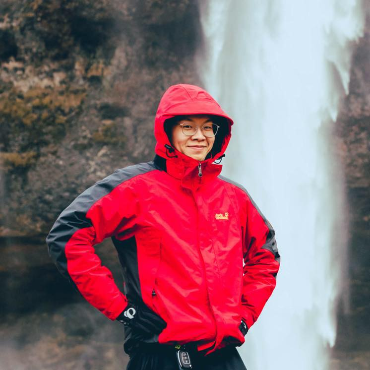

```{r, out.width = '30%', fig.align="center", echo = FALSE}
library(knitr)

```

I am a Graduate Student of Weill Cornell Medicine majored in Biostatistics with a strong biology background.
I get my B.S. degree in Crop Science - Plant Biotech and Molecular Biology at Univeristy of Illinois.
My resume can be find [here](file/resume.pdf).